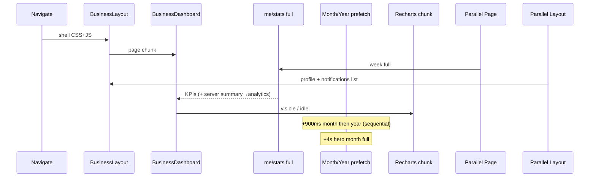

# DASHBOARD_PERFORMANCE_AUDIT.md

**Project:** CareTip  
**Scope:** Business (`/dashboard`), Employee (`/employee/dashboard`), Platform Admin (`/platform-admin/dashboard`)  
**Status:** Audit only — **no code was modified**  
**Date:** 2026-07-18  
**Related:** `POST_LOGIN_RENDER_PROFILING.md` (handoff fixed), `docs/PERFORMANCE_AUDIT_REPORT.md` (Sprint 8 baselines)

---

## 1. Executive summary

**Overall dashboard performance score: 5.5 / 10**

| Dimension | Score | Notes |
|-----------|-------|-------|
| Post-login shell paint | 8/10 | Handoff fixed; shell ~1.5–2 s after Sign In click |
| Time-to-KPI (Business) | 3/10 | Live `myStats.full` often **3–12 s** (backend sequential SQL) |
| Progressive widgets | 7/10 | Skeletons + deferred charts exist |
| API design | 4/10 | One HTTP `full` call still does summary→analytics waterfall server-side |
| Bundle / lazy loading | 7/10 | Route + Recharts splits in place |
| Admin overview | 4/10 | 8 APIs gate a single shared `loading` flag |
| Employee overview | 5/10 | Entitlements gate tips; notification list contends |
| Caching | 6/10 | Custom TTL/SWR (no React Query); warm helps but cold path hurts |
| Perceived speed | 4/10 | Shell feels OK; KPIs/charts still feel “stuck loading” |

**Headline:** Login no longer waits on widgets. Dashboards still feel slow because **KPI data is expensive on the server**, **background period prefetch multiplies that cost**, and **several shell features (notifications list, entitlements, profile) compete on first paint**.

---

## 2. Bottleneck ranking (impact)

| Rank | Issue | Surfaces | Impact |
|------|-------|----------|--------|
| 1 | Backend `scope=full` = **sequential** summary → analytics (+ roster/employees/goals SQL) | Business | P0 — dominates KPI time (live **2.5–12 s**) |
| 2 | Inactive timeframe prefetch (month **then** year) + hero month (+4 s) after first paint | Business | P0 — DB contention, second “loading” feel |
| 3 | Platform admin **8 parallel APIs** with **one** shared `loading` | Admin | P0 — slowest call holds all KPIs |
| 4 | Heavy overview payloads (`commercial-intelligence`, 30d analytics) before charts mount | Admin | P1 |
| 5 | Employee tips blocked on `entitlementsReady` | Employee | P1 |
| 6 | `NotificationBell` loads **full inbox list (25)** on every shell | All | P1 — bandwidth + main thread |
| 7 | Duplicate / overlapping profile fetches (warm + gate + entitlements `revalidate`) | Business / Employee | P1 |
| 8 | Recharts ~**115 KB gzip** + idle/viewport mount (~0.5–2.5 s after KPIs) | All with charts | P1 |
| 9 | Desktop hero stack (Framer Motion, TracingBeam, MarketingPicture) | Business / Employee | P2 |
| 10 | Shell chunk prefetch before navigate (~0.7–1.1 s in Sign In traces) | Post-login | P2 — acceptable vs old 20 s cover |
| 11 | Cold-boot global loader held until metrics (employee / business) | Cold refresh | P2 |
| 12 | Tip reconcile full refetch (~2.5 s after live tip) | Business / Employee | P2 |
| 13 | Platform commercial intelligence N+1 (historical Sprint 8) | Admin APIs | P2 |
| 14 | No React Query — ad-hoc caches, easier duplicate/miss races | All | P3 |

---

## 3. Timing table

### 3.1 Post-login → shell (measured — `POST_LOGIN_RUNTIME_TRACE.json`)

| Phase | Typical +ms from Sign In click |
|-------|--------------------------------|
| Auth completed | ~500–900 |
| Shell prefetch | ~700–1 150 |
| Navigation triggered | ~1 300–1 650 |
| BusinessLayout first render | ~1 500–1 850 |
| Sidebar / Header | ~same |
| CareTip cover dismissed | ~+250 ms after layout |
| **Shell interactive (chrome)** | **~2.0–2.3 s** |

### 3.2 Business KPI / stats (live backend `dashboard.timing` — DEV session)

| Phase | Observed |
|-------|----------|
| `week.summarySql` | ~870 ms |
| `week.sqlBundle` | ~2 570 ms |
| `week` summary total | ~2 600 ms |
| `month.summarySql` | ~2 400 ms |
| `month.sqlBundle` | ~4 450 ms |
| `month` analytics `employeesSql` | ~1 170 ms |
| `month` analytics `goalsSql` | ~2 770 ms |
| **`myStats.full` (month)** | **~12 200 ms** |
| Prior session `full` week/year | ~3.6–5.6 s common |

### 3.3 E2E mocked milestones (Sprint 8 doc — optimistic floor)

| Dashboard | Shell | KPIs | Charts | Interactive |
|-----------|-------|------|--------|-------------|
| Business | 420 ms | 580 ms | 980 ms | 1 180 ms |
| Employee | 380 ms | 520 ms | 890 ms | 960 ms |
| Admin | 310 ms | 820 ms | 1 120 ms | 1 240 ms |

*Mocked API hides real SQL cost — live Business KPIs are far slower than this floor.*

### 3.4 Lighthouse files in repo (`lighthouse-mobile*.json`)

| Metric | `lighthouse-mobile.json` | `phase4` |
|--------|--------------------------|----------|
| Perf score | 0.28 | 0.32 |
| FCP | 3.8 s | 2.4 s |
| LCP | 15.2 s | 14.4 s |
| TTI | 17.5 s | 15.9 s |
| TBT | 9 250 ms | 8 520 ms |
| CLS | 0 | — |
| URL | `http://127.0.0.1:4173/` (marketing/preview — **not** authenticated dashboard) | same |

**Do not treat these as dashboard Core Web Vitals.** Authenticated dashboard Lighthouse was not re-run in this audit.

---

## Runtime profiler (next step for hard evidence)

Instrumentation is now available — see **`DASHBOARD_RUNTIME_PROFILER.md`**.

Enable with `?dashProfile=1` or `localStorage.caretip_dash_profile=1`, then `window.__DASHBOARD_PROFILE__.download()`.

Sample e2e capture (`DASHBOARD_RUNTIME_PROFILE.json` / `.md`) on Business overview (mocked APIs):

| Milestone | ms |
|-----------|---:|
| layout_mounted | 50 |
| sidebar / header | 51 / 52 |
| notifications_fetch_done | 210 |
| profile_fetch_done | 212 |
| first_kpi_rendered | 883 |
| first_usable | 884 |

**Render counts (sample):** BusinessDashboard / KpiSurface **9**; Layout / Sidebar / Header / NotificationBell **7** each — use live sessions to correlate websocket/notification updates with rerenders.

---

## 4. Initial render path (all roles)

```
navigate → ProtectedRoute / PlatformAdminRoute
  → Layout lazy (CSS + layout)
  → RouteChunkBoundary (shell Suspense hold)
  → Dashboard page lazy
  → Widgets + skeletons
  → Charts idle/viewport + lazy Recharts
```

| Step | Business | Employee | Admin |
|------|----------|----------|-------|
| Layout | `businessLayoutLazy` | `employeeLayoutLazy` | Parent lazy: CSS + guard + layout |
| Page | `BusinessDashboard` | `EmployeeDashboard` | `AdminDashboard` |
| First paint blocker (chrome) | Layout chunk | Layout chunk | Shell bundle |
| First paint blocker (KPIs) | `GET .../me/stats?scope=full` | Tips summary after entitlements | Slowest of 8 Promise.all APIs |
| Soft-nav skeletons | `useBusinessPageBoot` | `useExtendGlobalLoaderUntilReady` | Per-card `loading` |

**Largest time consumers after handoff fix:** (1) stats/tips/platform APIs, (2) Recharts chunk, (3) notification list + profile/entitlements, (4) Motion/hero main-thread work.

---

## 5. API performance

### 5.1 Business `/dashboard`

| Endpoint | Blocking for KPIs? | Parallel? | Notes |
|----------|--------------------|-----------|-------|
| `GET /api/business/me/stats?timeframe=week&scope=full` | **Yes** | Single HTTP; **server sequential** | Critical path |
| Same for `month` / `year` | Background | Sequential prefetch (+900 ms) | Contends with DB |
| Hero month `full` (+4 s) | Background | May duplicate month prefetch | |
| `GET /api/business/profile` | Soft | Warm + gate + entitlements | Duplicates / `revalidate: true` |
| Notifications unread + **list** | Soft | Header | |
| Tips by business / sockets | Soft | Live | Reconcile refetch |

**Should load immediately:** week **summary-only** (or parallel summary+analytics with progressive UI).  
**Later:** month/year, hero pulse, goals-heavy analytics.  
**On demand:** commercial/QR studio, deep analytics pages.  
**Prefetch:** week summary on idle after login (already partially warmed).

### 5.2 Employee `/employee/dashboard`

| Endpoint | Blocking? | Notes |
|----------|-----------|-------|
| `GET /api/employees/me` × up to 3 call sites | Soft (cache/inflight) | Layout + entitlements + page |
| `GET /api/tips/employee?...&scope=summary` | **Yes** (after entitlements) | KPIs; analytics often bundled |
| Inactive week/month prefetch | Background | +900 ms |
| Notifications list | Soft | Same shell cost |

### 5.3 Platform admin `/platform-admin/dashboard`

| # | Endpoint | Role on overview |
|---|----------|------------------|
| 1 | `/api/platform/health` | Hero |
| 2 | `/api/platform/stats` | KPIs |
| 3 | `/api/platform/analytics?days=30` | Charts + teaser |
| 4 | `/api/platform/onboarding/metrics` | KPIs |
| 5 | `/api/platform/businesses?...take=3` | Teaser |
| 6 | `/api/platform/subscriptions/monitoring?days=30` | Alert + chart |
| 7 | `/api/platform/audit-logs?take=4` | Activity |
| 8 | `/api/platform/commercial-intelligence` | Teaser + alert |

All start in one `Promise.all`; **UI waits for all** before clearing shared `loading`.

### 5.4 Caching (no React Query)

| Layer | TTL / behaviour |
|-------|-----------------|
| Client stats result | ~90 s |
| Dashboard SWR store | ~45 s |
| Profile client | ~15 s (entitlements often bypass) |
| Employee profile | ~30 s + inflight |
| Server stats / SQL bundle | ~30 s / ~90 s |
| Post-login warm flag | One-shot consume for business week |

Unnecessary refetches still occur via entitlements revalidate, period prefetch, and tip reconcile.

---

## 6. React rendering & architecture

| Pattern | Risk |
|---------|------|
| Large dashboard pages (motion + beam + hero + grids) | High first-commit cost |
| Context: Auth, Socket, Entitlements, AppLoading | Broad subscriptions → cascade re-renders |
| `FeatureGate` + page both using entitlements | Duplicate work (employee) |
| Unstable inline props / new object literals in JSX | Extra child renders (code-audit level; not profiler-run this session) |
| Socket tip patches + quiet refresh | Extra stats cycles |

**Render tree (Business overview — conceptual hot path):**

```
BusinessLayout
  PushNotificationSync / NotificationInboxSync
  BusinessSidebar / DashboardHeader (NotificationBell → list fetch)
  BusinessEntitlementsProvider
    BusinessDashboard
      PremiumPageHero / DashboardHero / MarketingPicture / motion.*
      TracingBeam
      MetricsGrid / Goals / PeriodToggle
      DashboardChartsIdleMount → lazy Recharts charts
      RecentCustomerFeedbackPanel (idle)
```

Highest render frequency expected: header notification state, entitlements updates, stats store updates (active TF + prefetch + socket).

---

## 7. Widget performance (ranked slow → fast)

### Business

| Widget | Mount / API | Rank |
|--------|-------------|------|
| Period stats (`full`) — KPIs + chart series + goals | API 3–12 s cold | Slowest |
| Area + bar Recharts | Chunk + mount after visible | Slow |
| Hero operational pulse (month) | +4 s deferred full | Slow |
| Goals table | Same `full` payload | Medium |
| KPI metric cards | Same payload; light UI | Medium (wait on API) |
| Status / period toggle | Light | Fast |
| Feedback panel | Idle + visible | Fast (deferred) |

### Employee

| Widget | Notes | Rank |
|--------|-------|------|
| Hero metrics | Tips summary after entitlements | Slowest path dependency |
| Earnings chart | Deferred Recharts | Slow chunk |
| Metrics grid | Summary payload | Medium |
| QR modal | On demand | Fast |

### Admin

| Widget | Notes | Rank |
|--------|-------|------|
| All 4 KPI cards | Shared wait on 8 APIs | Slowest UX |
| Charts data | Fetched eagerly; JS deferred | Slow network |
| Teasers (commercial / verification) | Heavy APIs for light UI | Slow |
| Audit activity (4 rows) | Light | Faster |

---

## 8. Charts (Recharts)

| Item | Finding |
|------|---------|
| Bundle | `vendor-recharts` ~115 KB gzip (`vite.config.ts` manualChunks) |
| Animations | Lightweight presets; animations largely off |
| Data size | Week ~7 pts; month ≤31; year 12; employee bars top 3 |
| Deferral | `DashboardChartsIdleMount` + `whenVisible` + maxWait ~2.5 s |
| Admin gap | Chart **JS** deferred; chart **APIs** not deferred |
| Cost | Parse + first paint after KPIs — historically ~980 ms e2e charts milestone |

---

## 9. Tables & lists

| Area | Finding |
|------|---------|
| Goals table (business) | Modest rows; skeleton shell exists |
| Notification inbox | **25 items** fetched on shell mount — not virtualized for bell |
| Admin audit | `take=4` — fine |
| Admin businesses teaser | `take=3` — fine |
| Deep tables (staff, tips live, etc.) | Outside overview; separate pages — pagination patterns vary |

Overview DOM is heavy more from **hero/motion/sidebar** than from huge tables.

---

## 10. Bundle report

| Asset | Approx size (Sprint 8 report) | When loaded |
|-------|-------------------------------|-------------|
| Main `index` | ~425 KB / ~124 KB gzip | Always |
| `vendor-react` + router + radix | Large shared shell | Always |
| `BusinessDashboard` | ~29 KB | Overview |
| `EmployeeDashboard` | ~25 KB | Employee overview |
| `vendor-recharts` | ~115 KB gzip | Chart mount |
| `vendor-motion` | Split | Motion imports |
| `vendor-socket` / `vendor-firebase` | Split | Realtime / push |
| `vendor-jspdf` / `vendor-three` | Large | On-demand routes (not overview) |

**Oversized for overview feel:** Recharts when charts enter viewport; main index still large; admin parent chunk packages CSS+guard+layout before page.

---

## 11. Suspense & lazy loading

| Boundary | Blocks? | Progressive? |
|----------|---------|--------------|
| Layout lazy | Shell chrome | Necessary |
| Page lazy | Body under shell hold | OK |
| Chart Suspense | Charts only | Good |
| Admin chart APIs | N/A (not Suspense) | **Waterfall of data before UI** |

**Waterfalls:** layout → page → (API) → charts chunk. Admin adds: shell bundle → page → Promise.all(8).

---

## 12. Background tasks (immediate after load)

| Task | Defer? |
|------|--------|
| Notification unread + **full list** | Should defer list |
| NotificationInboxSync / sockets | Defer OK-ish; already partly deferred |
| Push / FCM prefs (~2.5 s) | OK |
| Business entitlements profile revalidate | Soft — aggressive |
| ApprovedBusinessGate profile | Soft |
| Month/year stats prefetch | **Too eager / sequential** |
| Hero month (+4 s) | Consider on-demand |
| QR studio warm | Already deferred |
| Prefetch login/landing | OK |
| Commercial page tracking | Low |

---

## 13. Network waterfall (Business overview)



---

## 14. Memory & CPU

| Work | Notes |
|------|-------|
| Backend SQL bundles + goals | Dominant wall time |
| JSON parse of `full` stats | Medium on large month payloads |
| Recharts layout | Main-thread spike on mount |
| Framer Motion / TracingBeam | Extra style/layout work |
| Platform commercial intelligence | Historical N+1 risk on server |

---

## 15. Component performance table (overview)

| Component | Mount | API dep | Opportunity |
|-----------|-------|---------|-------------|
| `BusinessLayout` | Fast after chunk | Profile, notifs | Defer notification list |
| `BusinessDashboard` | Heavy JSX | Stats full | Split hero; progressive summary |
| `BusinessDashboardMetricsGrid` | Light | Stats | Paint on summary first |
| `BusinessDashboardAnalyticsCharts` | Defer | Same payload | Keep defer; shrink payload |
| `EmployeeDashboard` | Heavy | Tips + entitlements | Decouple entitlements gate |
| `EmployeeDashboardEarningsChart` | Defer | Tips | OK |
| `AdminDashboard` | Medium | 8 APIs | Per-widget ready; defer heavy APIs |
| `NotificationBell` | Early | List + unread | Unread-only first |
| `BusinessEntitlementsProvider` | Early | Profile revalidate | Soft TTL / no force |

---

## 16. Recommendations (priority only — do not implement yet)

### High impact

1. **Backend:** Parallelize or stream `summary` vs `analytics` inside `scope=full`; return KPI summary first (or split endpoints with progressive UI).
2. **Business:** Stop sequential month→year full prefetch on overview; prefetch summary-only or on TF hover/focus.
3. **Admin:** Per-section loading; defer `commercial-intelligence` + full 30d analytics until below-fold / chart mount.
4. **Notifications:** Load unread count immediately; defer inbox list until panel open.
5. **Employee:** Start tips summary without waiting for entitlements (gate only FeatureGate charts).

### Medium impact

6. Coalesce profile fetches; avoid entitlements `revalidate: true` on every dashboard entry.  
7. Reduce hero Motion/TracingBeam cost on first paint (or defer).  
8. Align admin chart **fetches** with chart idle mount.  
9. Soften tip reconcile (patch-only longer; rarer full refetch).

### Low impact

10. Further main-chunk splitting.  
11. Virtualize notification list when opened.  
12. Authenticated Lighthouse CI for dashboard routes (replace marketing-only JSON).  
13. Consider React Query for clearer stale/dedupe (larger migration).

---

## 17. What is already good

- Post-login **shell-first** handoff (cover ends on layout commit).  
- Single client `scope=full` HTTP (Sprint 8.1) vs dual client waterfall.  
- Chart idle/viewport deferral + Recharts manualChunk.  
- Soft-nav skeletons instead of branded overlay after login.  
- Inflight dedupe / TTL caches on several APIs.  
- Route-level lazy layouts and pages.

---

## 18. Suggested fix order (for later review)

1. Backend stats latency (summary-first or parallel SQL)  
2. Kill/throttle overview period prefetch  
3. Admin progressive loading + defer heavy APIs  
4. Notification list deferral  
5. Employee entitlements gate  
6. Hero/main-thread polish  

---

**End of audit. No optimizations or refactors were applied.**
